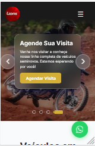
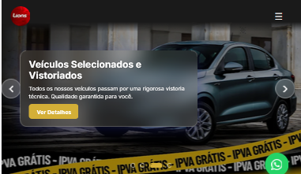
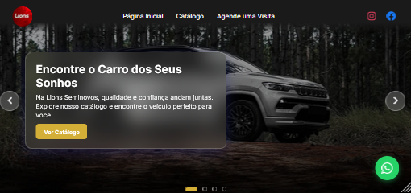
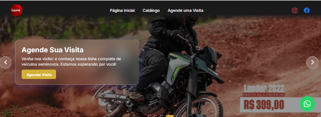

# Lions Seminovos - Teste


Teste prático de uma aplicação front-end inspirada no site da Lions Seminovos, desenvolvida com Next.js e React.

## 🧩 Como foi resolver esse teste
A maioria das funcionalidades deste site eu já havia desenvolvido em outros projetos e testes anteriores. Foi basicamente juntar essas partes como um quebra-cabeça e aplicá-las neste projeto. Ainda assim, em alguns momentos precisei voltar ao básico, errar, pesquisar bastante, quebrar a cabeça e refazer até chegar a uma solução.

Em determinadas partes, o processo foi literalmente um quebra-cabeça: passei horas tentando fazer funcionar (acredito que tenha dado certo 😅), aprendendo no processo. Não sei dizer se utilizei a forma mais correta ou a mais simples, mas foi a que consegui desenvolver com o conhecimento que adquiri.

Confesso que a parte dos veículos foi a mais desafiadora. A manipulação e filtragem dos dados se mostraram difíceis e cansativas (coitado do meu PC, nunca foi tão xingado como agora nesse projeto 💻🤬). Eu já havia feito algo parecido em projetos anteriores, porém nunca de forma tão criteriosa. Mesmo quando não dava certo, me forcei a continuar tentando. Recorri a tutoriais, conteúdos do Instagram e do YouTube, documentações oficiais e até à ajuda de amigos para conseguir avançar.

No final, foi um processo intenso e dificil, mas me mostrou onde tenho que melhorar e evoluir.

## 🚀 Funcionalidades

- **Página Inicial**: 
  - Carousel automático com 4 slides e rotação a cada 4 segundos
  - Navegação manual com botões laterais
  - Indicadores de slide (dots)
  - Efeito glassmorphism no card de texto
  - Veículos em destaque
  

- **Catálogo**: 
  - Listagem completa de veículos
  - Filtros por marca
  - Cards responsivos com imagens

- **Detalhes do Veículo**: (essa parte foi a mais difícil🤬💻😒)
  - Página para cada veículo (`/veiculo/[id]`)
  - Informações completas (ano, quilometragem, marca, preço)
  - Botões para agendar visita e WhatsApp

- **Agende uma Visita**: 
  - Formulário de contato para agendamento
  - Campos: nome, email, telefone, data, horário, mensagem

- **Header Fixo**: 
  - Header com posição fixa no topo
  - Gradiente transparente na parte inferior (70% escuro, 30% transparente)
  - Logo circular
  - Menu responsivo com animação
  - Ícones de redes sociais (Instagram e Facebook)

- **Botão WhatsApp Flutuante**: 
  - Botão fixo no canto inferior direito
  - Disponível em todas as páginas
  - Link direto para WhatsApp

- **Layout Responsivo**: 
  - Funciona perfeitamente em mobile, tablet e desktop
  - Menu hambúrguer para mobile

## 🛠️ Tecnologias

- **Next.js 14** 
- **React 18** 
- **TypeScript**  
- **React Icons** 

## 📦 Instalação

1. Instale as dependências:
```bash
npm install
```

2. Execute o servidor de desenvolvimento:
```bash
npm run dev
```

3. Acesse [http://localhost:3000](http://localhost:3000)

## 📁 Estrutura do Projeto

```
├── app/
│   ├── layout.tsx              # Layout principal (Header, Footer, WhatsAppFloat)
│   ├── page.tsx                # Página inicial
│   ├── page.module.css         # Estilos da página inicial
│   ├── globals.css             # Estilos globais e variáveis CSS
│   ├── agende-visita/          # Página de agendamento
│   ├── catalogo/               # Página do catálogo
│   └── veiculo/                # Página de detalhes do veículo
├── components/
│   ├── Footer.tsx              # Rodapé
│   ├── Header.tsx              # Cabeçalho com navegação fixa
│   ├── Hero.tsx                # Seção hero com carousel
│   ├── VehicleCard.tsx         # Card de veículo
│   └── WhatsAppFloat.tsx       # Botão flutuante do WhatsApp
├── data/
│   └── vehicles.ts             # Dados centralizados dos veículos
└── public/
    └── images/
        ├── banner/             # Imagens do carousel 
        ├── carros/             # Imagens dos veículos
        └── logo/               # Logo e favicon
        └── readme/             # Imagens do readme
```

## 🎨 Características do Design

- **Header Fixo**: 
  - Posição fixa no topo da página
  - Gradiente linear: escuro no topo (70%) e transparente na base (30%)
  - Logo circular com 50px de diâmetro
  - Menu mobile com animação de rotação no botão hambúrguer

- **Carousel Hero**: 
  - Transição automática a cada 4 segundos
  - Navegação infinita (loop)
  - Botões de navegação lateral
  - Indicadores de slide clicáveis
  - Card de texto com efeito glassmorphism
  - Posicionamento do card no canto inferior esquerdo

- **Cards de Veículos**: 
  - Imagens com `object-fit: contain` para evitar distorção
  - Link para página de detalhes individual
  - Layout responsivo em grid


## 📱 Responsividade

O site é totalmente responsivo e se adapta a:

- **Mobile**: 320px+ 
  
  

- **Tablet**: 768px+ 
  
  

- **Desktop**: 1024px+ 
  
  

- **Large Desktop**: 1280px+
  
   

## 🔗 Links Externos

- **Instagram**: `https://www.instagram.com/lionsseminovos`
- **Facebook**: `https://www.facebook.com/lionsseminovos`
- **WhatsApp**: Botão flutuante em todas as páginas


